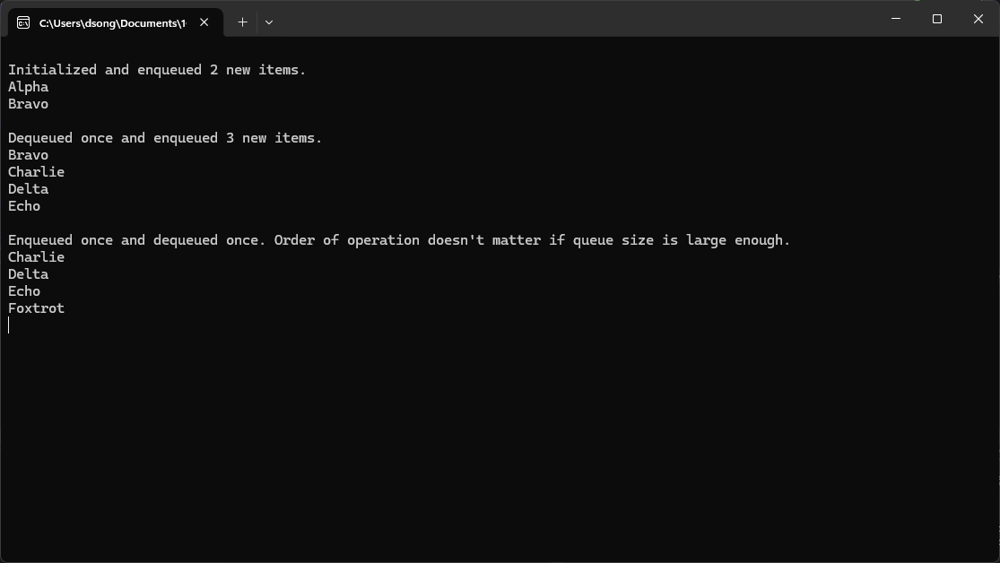

```csharp
CallerQueue queue = new CallerQueue();
queue.Enqueue("Alpha");
queue.Enqueue("Bravo");
Console.WriteLine("\nInitialized and enqueued 2 new items.");
foreach(CallerNode node in queue) { Console.WriteLine(node.ToString()); }

queue.Enqueue("Charlie");
queue.Enqueue("Delta");
queue.Enqueue("Echo");
queue.Dequeue();
Console.WriteLine("\nDequeued once and enqueued 3 new items.");
foreach(CallerNode node in queue) { Console.WriteLine(node.ToString()); }

queue.Enqueue("Foxtrot");
queue.Dequeue();
Console.WriteLine("\nEnqueued once and dequeued once. Order of operation doesn't matter if queue size is large enough.");
foreach(CallerNode node in queue) { Console.WriteLine(node.ToString()); }

Console.ReadKey();
```
